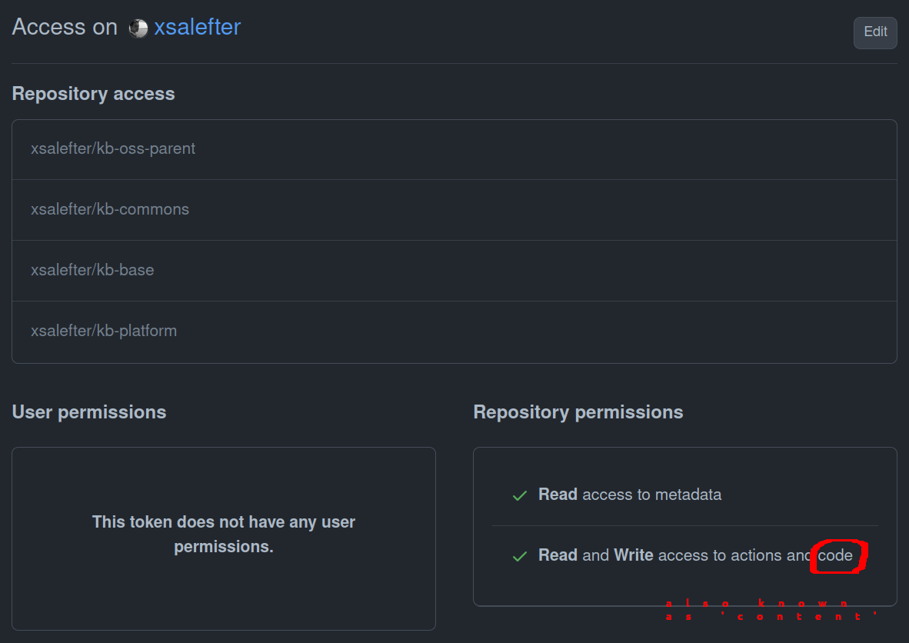

# Maven Continuous Release with GitHub Action

Case Study: You have 2 maven projects, A and B. You want that every successful release of project A will trigger release 
in project B automatically.

One of solution is using GitHub Action's `repository_dispatch` event to release "next" maven project automatically. This 
demo using these 2 projects to show it works:

- https://github.com/xsalefter/kb-commons
- https://github.com/xsalefter/kb-base

## Optional: Manual Deployment

This is optional step, and the purpose is to make sure your maven and cloudsmith configuration Ok.

Use [cloudsmith](https://cloudsmith.io) to for actual maven release. To deploy to cloudsmith:

1. Set up your cloudsmith account and maven repository over there.
2. Set your maven's `settings.xml` (see `sample-settings.xml` as an example). We'll use this dedicated `settings.xml` so
   this demo never broke your actual `<HOME>/.m2/settings.xml` that may contain your job's configuration.
3. In each project, call following command :
   `mvn clean install && mvn -B --gs settings.xml release:clean release:prepare release:perform`. Add these arguments to  
   set release/development version: ` -DreleaseVersion=1.0.1-RC1 -DdevelopmentVersion=1.0.1-SNAPSHOT `.

## Optional: Use GitHub Action

Optional step, to make sure your individual action event configured properly.

Before release, make sure that:

1. Read and write permissions are enabled in GitHub Action. (`Settings -> Actions -> General -> Workflow permissions`)
2. `CLOUDSMITH_USER` and `CLOUDSMITH_API_KEY` GitHub secrets variables are set up properly, by go to
   `Settings -> Secrets & Variables -> Actions -> "New Repository Secret" button`.
   Link for cloudsmith api key [is here](https://cloudsmith.io/user/settings/api/).

To start release:

1. Go to `Actions` tab.
2. In `Actions` section on the left pane, select `release` (or any other available workflows).
3. Select "Run Workflow" dropdown on the right, and click the "Run Workflow" button.
4. The [release](https://github.com/xsalefter/kb-oss-parent/blob/master/.github/workflows/release.yml) workflow should 
   start running.

## Use GitHub Action that send `repository_dispatch` event from kb-commons or kb-base

This workflow contains all steps as [Use GitHub Action](#optional-use-github-action) above, except that 
[kb-commons](https://github.com/xsalefter/kb-commons) or [kb-base](https://github.com/xsalefter/kb-base) will trigger [repository_dispatch](https://docs.github.com/en/webhooks-and-events/webhooks/webhook-events-and-payloads#repository_dispatch) event in 
`kb-oss-parent` (this repository), using `repository_dispatch`.

The `repository_dispatch` event in this repository defined by [release-dispatch.yml](https://github.com/xsalefter/kb-oss-parent/blob/master/.github/workflows/release-dispatch.yml) file. Note that `repository_dispatch` needs Personal Access Token 

How to create Personal Access Token:
- Go to your [developer settings](https://github.com/settings/apps), and then `-> Personal Access Token -> Fine-grained Tokens`.
- Click "generate new token" button, and configure it so that have an access like in the picture below.
- Set `metadata:read`, `actions:read&write` and `contents:read&write` (note that `contents` permission in screenshot labeled as `code`).
- This PAT need to set in each GitHub Action's secrets in each repository that send an event
  (For example, see line: `GITHUB_TOKEN: ${{ secrets.GH_SECRET }}` in `kb-commons/.github/workflows/release.yml`).

If everything set successfully, executing `release` with `send_repository_dispatch=yes` action will in `kb-commons` or 
`kb-base` will update `kb-commons.version` or `kb-base.version` in `kb-oss-parent/pom.xml` file.

